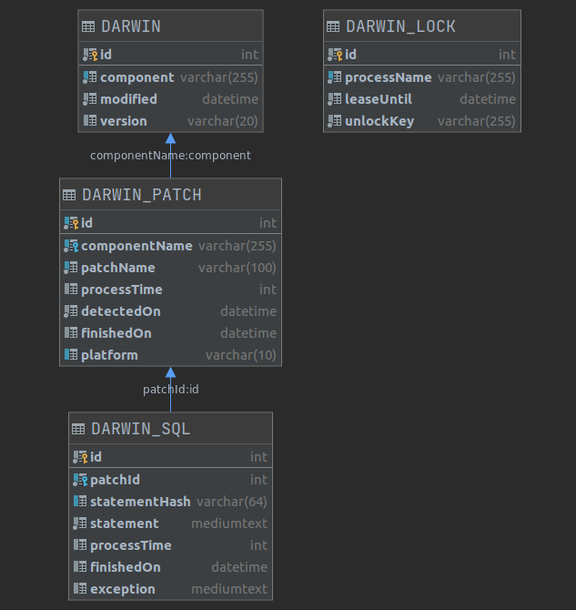

# Darwin infrastructural tables

Darwin creates following infrastructural tables in your database:

## DARWIN

Main Darwin table contains information about managed components, and their versions already applied to the database.
This table is consulted when Darwin compares version of the component given by the application and the version
currently in the database schema.

## DARWIN_PATCH

This table contains information about all patches any time detected on classpath. Contains information about how long it took
to apply them to the database schema and when they were successfully applied and to which platform they refer to (should
mirror the platform of the database).

## DARWIN_SQL

This table contains all SQL statements that exists in patches. Contains information about how long it took to apply 
the statement to the database schema and when they were successfully applied. Contains also full contents of the SQL
script and its MD5 hash that is used to recognize changed or added new SQL statements updated in already partially applied
patch.   

## DARWIN_LOCKER

Used by [Locker](src/main/java/one/edee/darwin/locker/Locker.java) class to store process locks. This table contains
records only when there are running processes keeping the locks. When application shuts down normally this table should
be empty.